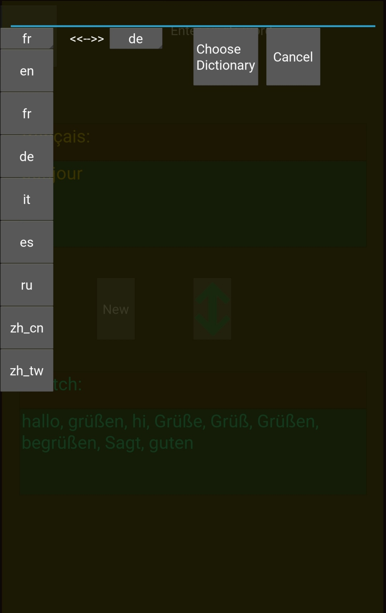
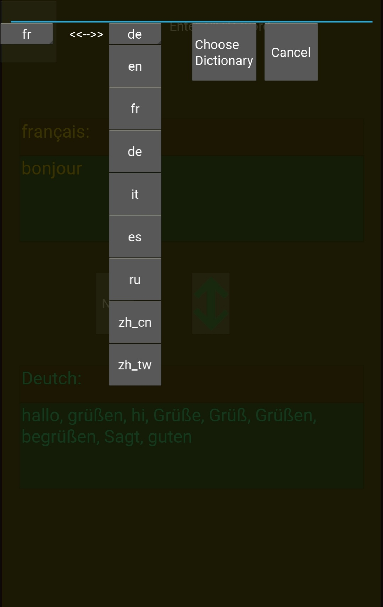
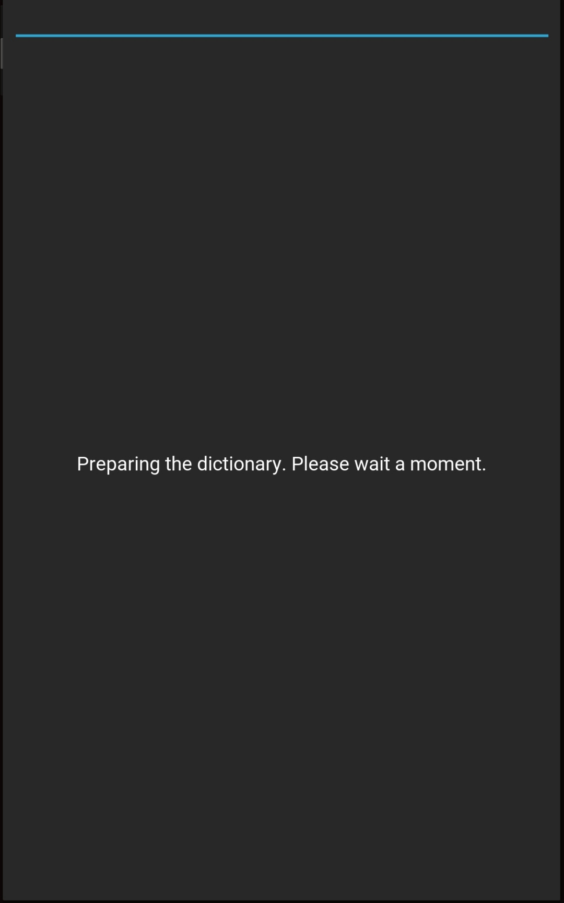
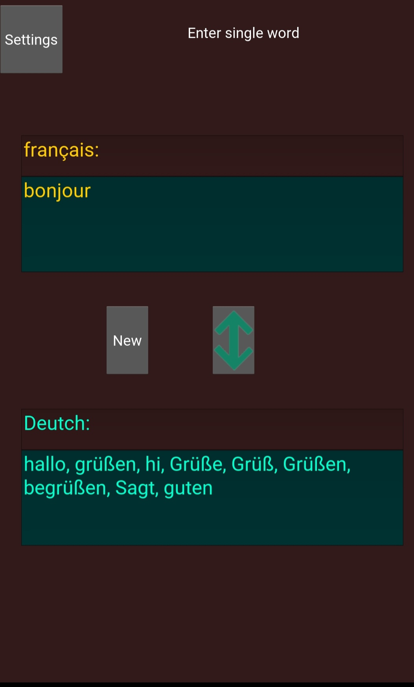
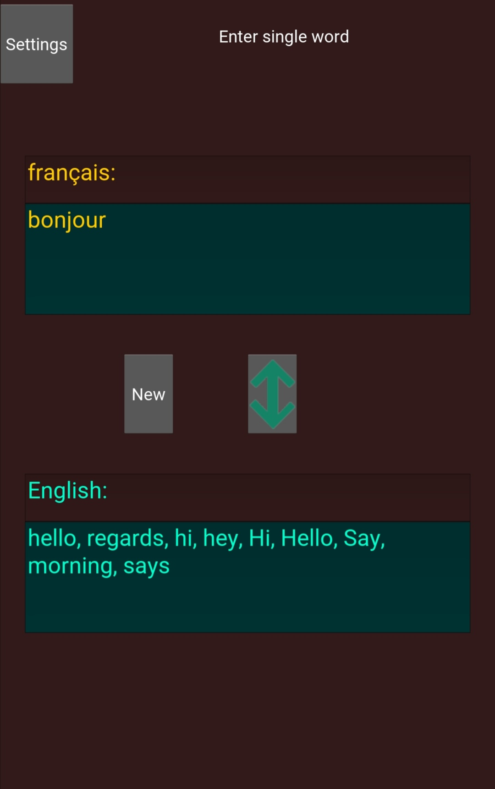
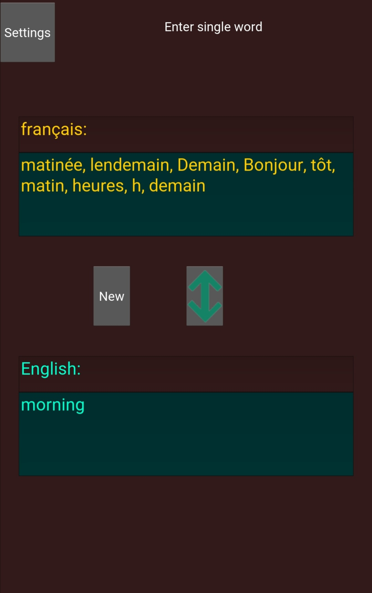
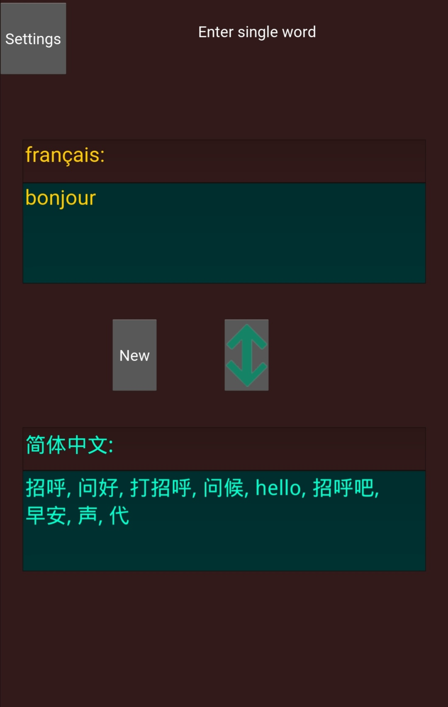

# WWTranslate

A multi-platform word translator for Android, iOS, Linux, macOS and Windows.

In the settings screen, choose the two languages (8 languages supported), then tap "Choose Dictionary".  If the pair of languages are chosen for the first time, a dictionary will be constructed with data fetched from the Internet.  Otherwise, the existing dictionary will be used.

In the main screen, there are two text boxes one above the other, each designated for a language.  You can enter a word (in the right language) in either box, tap the up-down arrow button, and will translations of the word appear in the other box.  Tap "New" for a new translation.

This is not a translator in the strict sense, but it gives words in the other language that are somewhat associated with the given word.

This is an experiment project based on Python and Kivy.  The words are generated with the help from project Word2Word (https://github.com/kakaobrain/word2word).

This software is released under the GPLv3 license (https://www.gnu.org/licenses/gpl-3.0.en.html)

A fully functional Android apk file is included in the releases.

 
 
 
